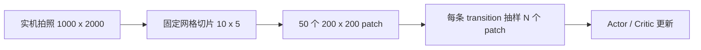
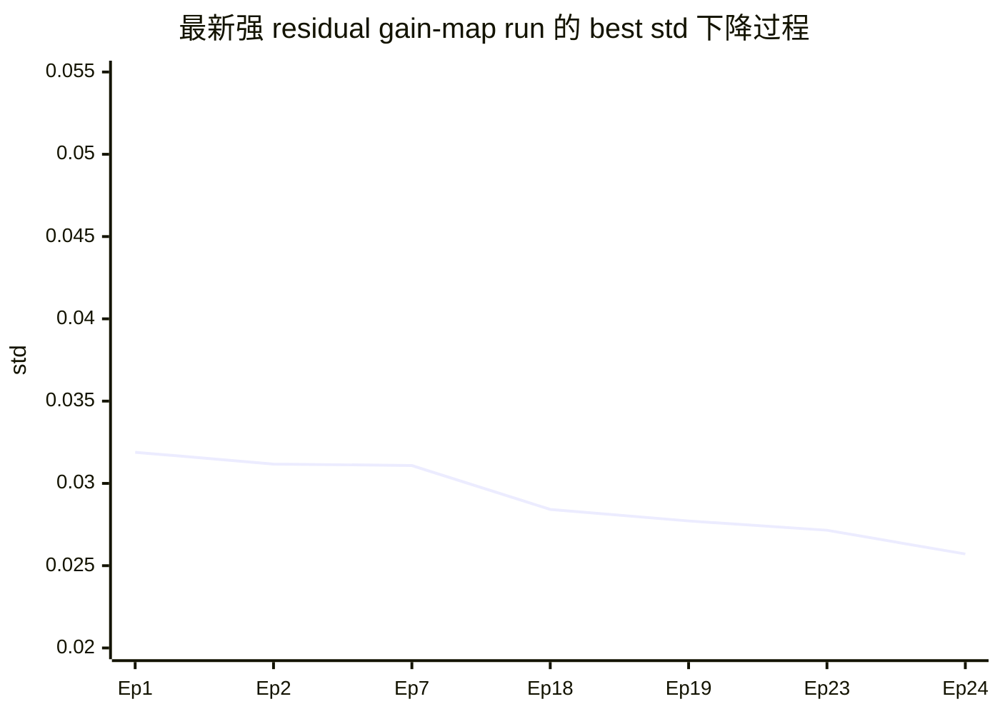
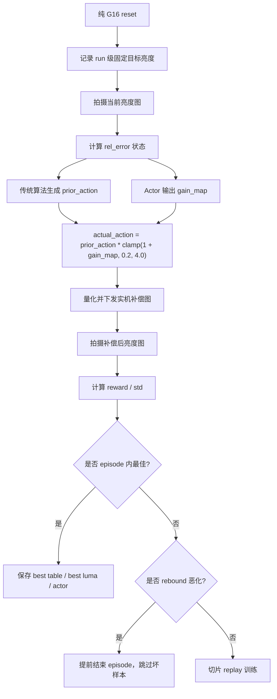

# 周报：G16 实机 Demura 强化学习训练优化

时间：2026-06-02 至 2026-06-11  
项目：`DemuraAI_RL / Demo3`  
目标灰阶：`G16`  
核心目标：在传统 Demura 物理先验补偿基础上，通过在线 RL 进一步降低补偿后亮度不均匀性，即降低 `std`，目标不是复现传统算法，而是在传统算法基础上继续提升。

---

## 一、本周进展

### 1. 明确训练范式问题，放弃纯 RL 接管

本周首先确认了当前实机场景不适合让 Actor 从零直接输出完整补偿图。原因是：

- 实机采样成本高，无法像仿真环境一样大量随机探索。
- 亮度测量存在噪声，单步 reward 不够平滑。
- 补偿图最终要经过 8 位量化，小 residual 容易被量化置零。
- 传统算法已经提供了有效物理方向，纯 RL 随机动作反而容易破坏已有补偿结构。

因此训练范式从：

```text
action = Actor(state)
```

调整为：

```text
actual_action = physical_prior + RL_correction
```

后续又进一步演进为当前更有效的方案：

```text
actual_action = physical_prior * scale_map
scale_map = clamp(1 + Actor(state), 0.2, 4.0)
```

### 2. 固定整次 run 的目标亮度

早期每个 episode 都重新测量目标亮度，会导致 reward、prior、rel_error 的参考基准不稳定。本周已将目标亮度改为 run 级固定：

- 第一次纯 `G16` reset 后，记录中心区域均值作为 `target_mean_nit`。
- 后续 episode 复用该目标，不再每轮重置。
- 训练目标与传统算法“以原始纯 16 灰阶中心为目标亮度”的设计一致。

这一改动解决了目标漂移问题，让不同 episode 的 reward 和 std 具有可比性。

### 3. 引入固定网格切片训练

原先随机裁剪方式对一次实机拍照的利用率不高。本周改为固定网格切片：

```text
1000 x 2000 ROI
=> 10 x 5 网格
=> 50 个 200 x 200 patch
=> 每条 transition 抽样 4 或 16 个 patch 参与训练
```

示意图：



效果：

- 一次拍照可复用为多个局部训练样本。
- 训练更关注局部 mura 分布。
- 减少长时间实机采样对训练效率的限制。

### 4. 实施方案 A：物理先验 + residual RL

第一版 residual 方案为：

```text
actual_action = prior_action + residual_action
```

其中：

- `prior_action` 来自传统 gamma 物理先验。
- Actor 只输出小幅 residual。
- Critic 训练时评估 `state + actual_action`，保证训练目标与真实执行动作一致。

效果：

- 相比纯 RL 更稳定。
- 但 residual clip 较小时，比如 `0.05` 或 `0.08`，经过 8 位量化后实际有效变化不足。
- 实机日志显示 residual 阶段收益很弱，动作经常接近被量化置零。

### 5. 实施方案 B：Actor 输出 prior 缩放/修正系数

在用户指出 `W16_model.bmp` 与 `W16_after.bmp` 的灰阶差值绝对值约 `0-3`，且严重 mura 场景差值可能更高之后，确认直接限制 residual 灰阶幅度过于保守。

因此本周将方案调整为：

```text
gain_map = Actor(state)
scale = clamp(1 + gain_map, 0.2, 4.0)
actual_action = prior_action * scale
```

当前关键代码位于 `train_real.py`：

```python
def apply_gain_map_to_prior(prior_action: torch.Tensor, gain_map: torch.Tensor) -> torch.Tensor:
    scale = torch.clamp(1.0 + gain_map, 0.2, 4.0)
    return prior_action * scale
```

该方案的核心优势：

- Actor 不再直接学习灰阶补偿，而是学习传统补偿应局部放大还是缩小。
- 传统算法继续提供正确物理方向。
- RL 负责学习传统算法不足的局部强弱修正。
- `scale_max=4.0` 后，模型可以探索一次传统补偿之外的有效区域。

### 6. 加入 best-step 保存和 rebound 保护

最新实机训练表明，episode 内最佳 step 可能明显优于 episode 最终 step。例如：

```text
Ep24 Step2 std=0.025710
Ep24 Step3 std=0.038180
```

如果只保存 episode 结束结果，会错过真正有效的补偿点。因此本周采用：

- episode 内按最佳 step 保存 `best_actor_real.pth`。
- 保存对应 `Best_DemuraTable`、量化表和 `Best_Luma`。
- 当 step 相比 episode 内最佳值明显反弹时，触发 rebound early stop。
- 反弹 step 不写入 replay，避免坏样本污染训练。

---

## 二、项目关键进展及效果

### 1. 最近几轮实机训练对比

| Run | 主要设置 | 最优 std | 效果判断 |
|---|---:|---:|---|
| `run_20260602_104806` | residual 很小，noise `0.005` | `0.038932` | 动作过弱，几乎没有收益 |
| `run_20260602_114421` | noise 提升到 `0.15` | `0.035553` | 有改善，但仍偏保守 |
| `run_20260602_122600` | 40 episodes，轻量切片 | `0.032184` | prior + residual 开始有效 |
| `run_20260602_141233` | 较保守 gain-map | `0.034619` | 稳定但提升有限 |
| `run_20260602_145921` | `scale_max=4.0`，强 residual 探索 | `0.025710` | 当前最佳，明显超过 prior 阶段 |

### 2. 最新最佳 run 结果

Run 目录：

```text
RealWorld_Train/run_20260602_145921_146406_G16
```

训练参数摘要：

```text
episodes=32
steps=8
batch=16
effective_batch=64
patch=200x200
patches_per_transition=4
grid=10x5
residual_noise_init=0.3500
residual_noise_min=0.0800
scale_max=4.0
```

关键日志节点：

| 阶段 | Episode / Step | std | residual_abs_mean | actual_action_abs_mean | 说明 |
|---|---:|---:|---:|---:|---|
| 未补偿起点 | Ep2 Step1 | `0.052874` | `0.000120` | `0.036977` | 每个 episode reset 后起点 |
| prior-only 最优附近 | Ep2 Step4 | `0.031176` | `0.000120` | `0.019572` | 传统物理先验已有明显效果 |
| residual 开始有效 | Ep18 Step3 | `0.028418` | `0.673625` | `0.037705` | RL 开始超过 prior |
| 继续提升 | Ep19 Step3 | `0.027719` | `0.898434` | `0.038223` | gain-map 修正增强 |
| 强 residual 有效区 | Ep23 Step2 | `0.027154` | `2.386491` | `0.073238` | 明显超过保守方案 |
| 当前最佳 | Ep24 Step2 | `0.025710` | `2.598391` | `0.072880` | 本周最佳结果 |
| 过补偿 | Ep24 Step3 | `0.038180` | `2.573581` | `0.063295` | 多执行一步后恶化 |

### 3. 数据支撑：std 改善幅度

以最新最佳 `std=0.025710` 为准：

| 对比基准 | std | 相对改善 |
|---|---:|---:|
| 未补偿起点 | `0.052874` | 约 `51.4%` 降低 |
| prior-only 最优附近 | `0.031176` | 约 `17.5%` 进一步降低 |
| 前一阶段较好结果 | `0.032184` | 约 `20.1%` 进一步降低 |
| 保守 gain-map run | `0.034619` | 约 `25.7%` 进一步降低 |

计算方式：

```text
improvement = (baseline_std - best_std) / baseline_std
```

### 4. best std 下降过程



### 5. 当前训练过程图

最近最佳 run 自动生成了训练过程图，可作为周报配图：


对应最佳输出文件：

```text
RealWorld_Train/run_20260602_145921_146406_G16/best_actor_real.pth
RealWorld_Train/run_20260602_145921_146406_G16/Best_DemuraTable_Gray16_Std0.026.tiff
RealWorld_Train/run_20260602_145921_146406_G16/Best_DemuraTable_Gray16_Std0.026_quantized.tiff
RealWorld_Train/run_20260602_145921_146406_G16/Best_Luma_Gray16_Std0.026.tiff
```

### 6. 当前最终方案

当前最有效的完整流程为：

```text
固定目标亮度
+ 传统物理先验 prior
+ Actor 输出 prior 缩放/修正系数
+ 固定网格切片训练
+ episode 内 best-step 保存
+ rebound 恶化保护
```

整体流程图：



阶段性结论：

- 方案 B 已证明有效。
- RL 已经不是简单复现传统算法，而是在传统物理先验基础上进一步降低了 std。
- 当前最佳 `std=0.025710`，相比 prior-only 最优附近继续降低约 `17.5%`。

---

## 三、问题点详细说明

### 1. 为什么前几个 episode 没有明显改善

早期训练使用较大的 `batch_size`，replay buffer 样本数量不足时，网络并没有真正开始有效更新。因此 Episode 3 / 4 / 5 的表现不能说明训练没有价值，只能说明当时还处在经验收集阶段。

改进方向：

- 降低初期 batch 或提高每条 transition 的 patch 利用率。
- 使用固定网格切片，让每次实机拍照产生更多训练 patch。
- 日志中区分“采样阶段”和“网络已更新阶段”。

### 2. 为什么每个 episode 第一个 step reward 都差

每个 episode 都会 reset 到纯 `G16` 初始画面。第一个 step 面对的是未补偿状态，因此 reward 经常约为 `-18`，std 约为 `0.0528`：

```text
Ep 0002 step 01 reward=-18.542 std=0.052874
Ep 0003 step 01 reward=-18.543 std=0.052887
Ep 0004 step 01 reward=-18.508 std=0.052837
```

这不是模型每轮重新训练，而是环境每轮重新从初始未补偿图开始。训练进步应看 episode 内最佳 step 和全局 best std，而不是只看 step 1。

### 3. 为什么小 residual 没有效果

实机最终执行的是量化后的补偿表。若 residual clip 太小，例如 `0.05`、`0.08`，映射到实际灰阶后容易被 8 位量化吞掉，导致：

```text
residual_abs_mean 有值
但 effective_action_abs_mean 接近 0
```

这会造成“网络在输出，但屏幕实际没变化”的现象。

解决思路：

- 不再让 Actor 直接输出小灰阶 residual。
- 改成输出 prior 的缩放系数。
- 将 `scale_max` 放宽到 `4.0`，允许补偿强度超过一次传统补偿。

### 4. 为什么强 residual 后会出现过补偿

最新最佳 run 中，模型已经能找到明显更优的补偿点，但继续执行下一步会恶化：

```text
Ep24 Step2 std=0.025710
Ep24 Step3 std=0.038180
```

这说明当前动作强度已经足够，甚至偏强。主要瓶颈从“动作不够强”变成：

```text
最优补偿窗口窄，继续 rollout 容易过补偿
```

解决思路：

- 缩短 `steps`，例如从 8 降到 4 或 3。
- 使用 episode 内 best-step 保存。
- 收紧 rebound early stop。
- 后续从 best actor 低噪声精修，而不是每次重新强探索。

### 5. 为什么 episode final std 不能代表最好效果

CSV 中的 episode 级 std 是 episode 结束时的结果，但最佳补偿可能出现在中间 step。比如 Ep24：

```text
Step2 std=0.025710
Step3 std=0.038180
Episode done std=0.038180
```

如果只看 episode final std，会误判这轮训练失败；但实际上 Step2 已经达到本周最佳。

因此当前必须保存：

- best-step actor
- best-step demura table
- best-step luma

### 6. 当前代码和流程仍存在的问题

当前主要剩余问题：

- 还没有 `--resume-actor`，无法直接从最佳模型继续精修。
- `scale_max=4.0` 目前是代码内固定值，后续最好变成 CLI 参数。
- 后期训练存在策略漂移，Ep24 达到最优后，Ep27-Ep32 未继续提升。
- 部分日志中 rebound 与 std_ratio 的提示语义容易混淆，需要优化日志表达。
- `refData` 尚未接入离线预热，仍主要依赖实机在线探索。

---

## 四、下周计划

### 1. 实现 checkpoint resume

新增参数：

```text
--resume-actor path/to/best_actor_real.pth
```

目标：

- 第一阶段用强探索找到好点。
- 第二阶段从 `best_actor_real.pth` 继续训练。
- 避免每次从随机 Actor 重新探索。
- 提高实机训练效率和稳定性。

建议第二阶段精修方式：

```text
从 std=0.025710 的 best actor 开始
降低噪声
降低学习率
缩短 steps
收紧 rebound
```

### 2. 将 scale 上下限改为 CLI 参数

当前代码中：

```python
scale = torch.clamp(1.0 + gain_map, 0.2, 4.0)
```

下周建议改为：

```text
--gain-scale-min 0.2
--gain-scale-max 4.0
```

这样便于实机上快速比较：

- `scale_max=3.0`
- `scale_max=4.0`
- `scale_max=5.0`

避免每次手动改代码。

### 3. 做低噪声精修实验

当前不带 resume 的建议指令：

```powershell
E:\softWare\Anaconda\envs\Pytorch\python.exe train_real.py --gray 16 --episodes 28 --steps 4 --batch-size 16 --buffer-capacity 384 --learn-crop-size 200 --slice-grid-rows 10 --slice-grid-cols 5 --patches-per-transition 4 --prior-only-episodes 1 --prior-gain 0.12 --prior-gamma 2.2 --residual-clip 4.0 --residual-noise-init 0.25 --residual-noise-min 0.04 --actor-lr 8e-5 --critic-lr 1.5e-4 --gamma 0.8 --tau 0.02 --max-std-ratio-for-replay 1.10 --max-std-ratio-for-episode 1.18 --max-step-std-rebound-ratio 1.08 --max-step-std-rebound-abs 0.002 --patience 16
```

实现 resume 后，建议第二阶段精修指令：

```powershell
E:\softWare\Anaconda\envs\Pytorch\python.exe train_real.py --gray 16 --episodes 16 --steps 3 --batch-size 16 --buffer-capacity 384 --learn-crop-size 200 --slice-grid-rows 10 --slice-grid-cols 5 --patches-per-transition 4 --prior-only-episodes 0 --prior-gain 0.12 --prior-gamma 2.2 --residual-clip 4.0 --residual-noise-init 0.12 --residual-noise-min 0.03 --actor-lr 4e-5 --critic-lr 1e-4 --gamma 0.8 --tau 0.02 --max-std-ratio-for-replay 1.08 --max-std-ratio-for-episode 1.15 --max-step-std-rebound-ratio 1.06 --max-step-std-rebound-abs 0.0015 --patience 10 --resume-actor RealWorld_Train\run_20260602_145921_146406_G16\best_actor_real.pth
```

### 4. 接入 refData 离线预热

`refData` 中已有：

```text
W16_input.bmp / .tiff：原始输入
W16_after.bmp / .tiff：一次传统算法补偿
W16_model.bmp / .tiff：多次传统算法叠加后的较优结果
```

其中 `W16_model.bmp - W16_after.bmp` 的灰阶差值绝对值约 `0-3`，说明从一次传统补偿到较优补偿之间存在可学习的修正量。

下周可尝试：

```text
target_scale ≈ model_delta / after_delta
```

或：

```text
Actor(state_after) -> gain_map
prior_after * scale ≈ model
```

目标：

- 先用 `refData` 做 Actor 预热。
- 减少实机在线随机探索。
- 让在线 RL 从更接近传统多次迭代结果的位置开始。

### 5. 优化日志和评估口径

下周建议日志中明确区分：

- 当前 step std
- episode final std
- episode best std
- global best std
- rebound stop 原因
- std_ratio guard 原因
- effective_action_abs_mean
- quantized_delta_abs_mean

这样可以避免只看 episode final std 误判训练效果。

---

## 总结

本周最重要的进展是确认并验证了当前项目的有效技术路线：

```text
物理先验 + prior 缩放型 residual RL + 固定切片训练 + best-step 保存
```

最新实机最佳结果：

```text
std = 0.025710
```

该结果相比未补偿起点降低约 `51.4%`，相比 prior-only 最优附近继续降低约 `17.5%`。这说明 RL 已经开始在传统算法基础上产生增益，而不是只复现传统算法。

下周重点应从“继续加大动作”转向“稳定和复用最优点”，优先实现 `--resume-actor`、参数化 `scale_max`、低噪声精修，以及基于 `refData` 的离线预热。
